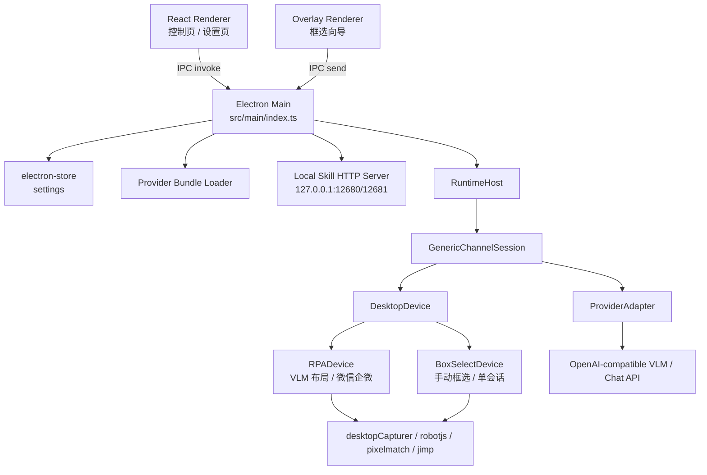
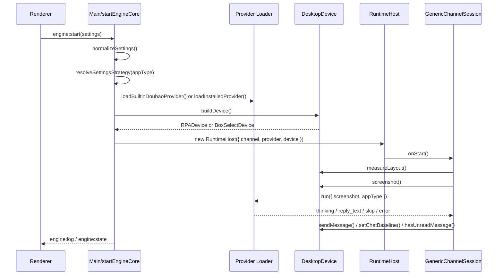

# SightFlow Desktop Agent 项目文档

本文档基于当前仓库源码整理，目标是让开发者快速理解 SightFlow Desktop Agent 的产品目标、架构边界、运行链路、核心模块、扩展方式、调试测试与打包发布流程。

## 1. 项目定位

SightFlow Desktop Agent 是一个基于 Electron 的桌面 RPA 客户端。它通过屏幕截图、视觉语言模型（VLM）、像素差异检测和鼠标键盘自动化，在本机桌面 IM 应用中完成“发现新消息 -> 截图分析 -> 生成回复 -> 发送回复”的闭环。

当前仓库重点支持两类运行模式：

- **VLM 自动布局模式**：主要面向微信和企业微信。应用用 VLM 识别聊天窗口布局、未读入口和联系人区域，然后使用缓存坐标执行截图、红点检测和点击动作。
- **手动框选模式**：面向钉钉、飞书 / Lark、Slack、Telegram、通用桌面应用等布局差异更大的目标。用户手动框选联系人列表、聊天主区域和输入框，运行时只对当前已打开会话做聊天区截图差异检测和回复发送。

聊天回复能力被抽象为 **Provider**。默认内置火山引擎方舟 / 豆包 Provider，也可以通过 `manifest.json + provider.bundle.js` 接入外部聊天服务。

## 2. 技术栈

| 层级     | 技术 / 包                                              | 用途                                 |
| -------- | ------------------------------------------------------ | ------------------------------------ |
| 桌面壳   | Electron 39、electron-vite                             | 主进程、preload、renderer 打包和运行 |
| 前端     | React 19、Vite                                         | 主控制面板、设置页、框选浮层         |
| 自动化   | `@hurdlegroup/robotjs`、Electron clipboard             | 鼠标移动、点击、粘贴、按键发送       |
| 窗口定位 | `active-win`、`node-window-manager`、Electron `screen` | 获取微信 / 企业微信窗口和显示器信息  |
| 截图     | Electron `desktopCapturer`                             | 屏幕 / 窗口 / 区域截图               |
| 图像处理 | `jimp`、`pngjs`、`pixelmatch`                          | 红点像素扫描、聊天区 diff            |
| AI 调用  | OpenAI 兼容 `/chat/completions`                        | VLM 布局检测、截图回复生成           |
| 配置存储 | `electron-store`                                       | 用户设置、Provider、框选区域持久化   |
| 打包     | electron-builder                                       | macOS / Windows / Linux 打包         |

## 3. 目录结构

```text
.
├── README.md                         # 快速开始、模型配置和 Provider 入口说明
├── docs/
│   ├── provider.md                   # 外部聊天 Provider 接入协议
│   └── project.md                    # 当前项目全局文档
├── resources/
│   ├── icon.png
│   ├── logo.png
│   └── providers/volcengine-ark/     # 内置火山方舟 Provider 示例
├── scripts/
│   ├── dev-launch.mjs                # 开发启动包装，Windows 下先切 UTF-8 代码页
│   └── test-cli.ts                   # Electron 主进程原子测试入口
├── skills/sightflow-agent/SKILL.md   # OpenClaw / Skill HTTP 控制说明
├── src/
│   ├── main/                         # Electron 主进程、IPC、Provider 安装、框选窗口、权限、Skill Server
│   ├── preload/                      # Renderer 可访问的安全桥
│   ├── renderer/                     # React 主界面和框选浮层
│   └── core/                         # 运行时、会话、设备抽象、RPA 原子能力、AI 客户端
├── electron.vite.config.ts           # Electron Vite 多入口配置
├── electron-builder.yml              # 打包配置
└── package.json                      # 脚本和依赖
```

## 4. 运行入口

### 4.1 Electron 主进程

主进程入口是 [`src/main/index.ts`](../src/main/index.ts)。它负责：

- 创建主窗口。
- 初始化 macOS 权限检查。
- 注册设置、Provider、引擎、截图、框选、测试相关 IPC。
- 启动本地 Skill HTTP Server。
- 在 `startEngineCore()` 中组装 Provider、Device、ChannelSession 和 RuntimeHost。
- 在 `stopEngineCore()` 中停止运行时并同步 UI 状态。

### 4.2 Preload

[`src/preload/index.ts`](../src/preload/index.ts) 通过 `contextBridge` 暴露两个对象：

- `window.electron.invoke(channel, ...args)`：调用主进程 `ipcMain.handle`。
- `window.electron.on(channel, callback)`：监听主进程事件。
- `window.electron.send(channel, ...args)`：发送 fire-and-forget 事件。
- `window.osInfo.platform`：暴露当前平台。

Renderer 不直接访问 Node / Electron API，而是通过这个桥接层与主进程通信。

### 4.3 Renderer 主界面

主界面入口是 [`src/renderer/src/App.tsx`](../src/renderer/src/App.tsx)，包含：

- 控制页：引擎状态、目标应用选择、框选入口、运行日志。
- 底部操作栏：启动 / 停止引擎、进入设置。
- 设置页：视觉配置、连接测试、聊天 Provider 安装和独立 API Key 配置。
- Toast：操作反馈。

### 4.4 框选浮层

框选浮层入口是 [`src/renderer/overlay/OverlayApp.tsx`](../src/renderer/overlay/OverlayApp.tsx)。主进程通过 [`src/main/overlay-window.ts`](../src/main/overlay-window.ts) 打开一个透明、全屏、置顶 BrowserWindow，用户按步骤框选：

1. `contactList`：联系人 / 会话列表。
2. `chatMain`：聊天记录主区域。
3. `inputBox`：消息输入框。

完成后浮层发送 `overlay-wizard:complete`，主进程把结果持久化到 `settings.capture[appType].regions`。

## 5. 总体架构



核心设计是把运行流程拆成三层：

- **RuntimeHost**：通用事件队列和生命周期管理。
- **ChannelSession**：业务状态机，定义“何时截图、何时调用 Provider、何时检测未读、何时重试”。
- **DesktopDevice**：面向桌面应用的感知和动作能力，隐藏 VLM / 框选 / 截图 / 点击细节。

这种结构让微信 VLM 路线和通用框选路线可以复用同一套会话状态机。

## 6. 设置模型

主进程使用 `electron-store` 存储 `AppSettings`。默认值定义在 [`src/main/index.ts`](../src/main/index.ts)。

```ts
interface AppSettings {
  locale: 'zh' | 'en'
  appType: AppType
  vision: {
    apiKey: string
    model: string
    baseURL: string
  }
  chatProvider: {
    manifestUrl: string
    installed: InstalledProviderInfo | null
    config: Record<string, any>
  }
  defaultCaptureStrategy: CaptureStrategy
  capture: Partial<Record<AppType, PerAppCapture>>
}
```

关键点：

- `vision.apiKey`、`vision.model`、`vision.baseURL` 用于 VLM 布局检测；内置 Doubao Provider 的 `apiKey`、`model`、`baseURL` 在聊天服务卡片中单独配置，互不复用。
- `chatProvider.installed = null` 表示使用内置 Doubao Provider。
- `defaultCaptureStrategy` 和 `capture[appType].strategy` 共同决定实际抓取策略。
- `capture[appType].regions` 保存手动框选区域。
- `normalizeSettings()` 兼容旧版 `apiKey`、`model`、`systemPrompt` 等持久化字段。

### 6.1 AppType

定义在 [`src/core/rpa/types.ts`](../src/core/rpa/types.ts)：

```ts
type AppType = 'wechat' | 'wework' | 'dingtalk' | 'lark' | 'slack' | 'telegram' | 'generic'
```

### 6.2 CaptureStrategy

```ts
type CaptureStrategy = 'auto' | 'vlm' | 'box-select'
```

策略解析规则：

- `auto + wechat/wework` -> `vlm`
- `auto + 其他应用` -> `box-select`
- 显式 `vlm` -> 使用 VLM 布局检测
- 显式 `box-select` -> 使用手动框选区域；没有区域时自动打开框选向导

## 7. IPC 通道

### 7.1 设置 IPC

| 通道              | 方向             | 说明                                                   |
| ----------------- | ---------------- | ------------------------------------------------------ |
| `settings:getAll` | Renderer -> Main | 获取完整设置，返回 normalize 后的配置                  |
| `settings:get`    | Renderer -> Main | 获取单个顶层 key                                       |
| `settings:set`    | Renderer -> Main | 深合并保存设置、视觉配置、Provider 配置和 capture 配置 |

### 7.2 Provider IPC

| 通道                      | 方向             | 说明                                                       |
| ------------------------- | ---------------- | ---------------------------------------------------------- |
| `provider:installFromUrl` | Renderer -> Main | 根据 manifest URL 安装 / 更新 Provider                     |
| `provider:getInstalled`   | Renderer -> Main | 获取当前 Provider；未安装自定义 Provider 时返回内置 Doubao |

### 7.3 引擎 IPC

| 通道                    | 方向             | 说明                                      |
| ----------------------- | ---------------- | ----------------------------------------- |
| `engine:start`          | Renderer -> Main | 启动运行时                                |
| `engine:stop`           | Renderer -> Main | 停止运行时                                |
| `engine:status`         | Renderer -> Main | 查询运行状态                              |
| `engine:updateConfig`   | Renderer -> Main | 运行中更新 API Key 和目标应用             |
| `engine:testConnection` | Renderer -> Main | 用视觉 API Key 测试方舟连接               |
| `engine:log`            | Main -> Renderer | 推送 thinking / reply / skip / error 日志 |
| `engine:state`          | Main -> Renderer | 推送 running / idle 状态                  |

### 7.4 框选 IPC

| 通道                      | 方向             | 说明                          |
| ------------------------- | ---------------- | ----------------------------- |
| `capture:openSetupWizard` | Renderer -> Main | 打开框选向导                  |
| `capture:getRegions`      | Renderer -> Main | 获取某个 appType 的已保存区域 |
| `capture:resetRegions`    | Renderer -> Main | 清空某个 appType 的区域       |
| `capture:regions-updated` | Main -> Renderer | 通知 UI 区域已更新            |
| `overlay-wizard:init`     | Main -> Overlay  | 初始化浮层向导参数            |
| `overlay-wizard:complete` | Overlay -> Main  | 返回最终 BoxRegions           |
| `overlay-wizard:cancel`   | Overlay -> Main  | 取消向导                      |

### 7.5 测试 / 调试 IPC

| 通道                | 方向             | 说明                              |
| ------------------- | ---------------- | --------------------------------- |
| `capture-screen`    | Renderer -> Main | 获取首个屏幕的 1920x1080 缩略截图 |
| `test:vlm-parallel` | Renderer -> Main | 运行 VLM 未读区域检测计时测试     |
| `ping`              | Renderer -> Main | 简单连通性测试                    |

## 8. 引擎启动流程

`startEngineCore()` 是引擎启动的主入口。



启动前置校验：

- 如果运行时已在运行，返回 `already_running`。
- 如果实际策略是 `vlm`，必须有 `vision.apiKey`。
- 如果使用内置 Doubao Provider，必须在聊天服务配置里单独填写 `apiKey`。
- 自定义 Provider 会按 manifest 的 `required` 字段校验必填配置。
- `box-select` 策略没有区域时会自动打开框选向导；用户取消则启动失败并返回 `wizard_cancelled`。

## 9. RuntimeHost

[`src/core/runtime-host.ts`](../src/core/runtime-host.ts) 是通用运行宿主。

职责：

- 管理 `running`、`stopping` 状态。
- 维护事件队列 `queue`。
- 提供 `enqueue()` 和 `schedule()`。
- 调用 Channel 的 `onStart()`、`onEvent()`、`onStop()`。
- 将 Provider 调用封装成 `host.runProvider(input)`。
- 统一捕获事件处理异常，记录错误并停止会话。

它不理解微信、截图、红点和输入框，只负责稳定地驱动事件流。

## 10. GenericChannelSession 状态机

[`src/core/generic-channel-session.ts`](../src/core/generic-channel-session.ts) 是当前主业务状态机。

状态：

```ts
interface GenericChannelState {
  measuredAt: number | null
  latestChatBaseline: number | null
}
```

事件：

| 事件                  | 说明                                    |
| --------------------- | --------------------------------------- |
| `bootstrap`           | 启动布局测量                            |
| `observe_chat`        | 截图当前聊天区并转发给 Provider         |
| `provider.thinking`   | 把 Provider 状态写入 UI 日志            |
| `provider.reply_text` | 发送回复、记录 baseline、进入未读检测   |
| `provider.skip`       | 本轮不回复、记录 baseline、进入未读检测 |
| `provider.error`      | Provider 异常，等待后重试               |
| `check_unread`        | 先检测当前聊天区 diff，再检测未读入口   |
| `wait_retry`          | 延迟后重新 observe 或 check_unread      |

运行逻辑：

1. `onStart()` 设置目标应用、清空 baseline、调用设备启动 hook，并入队 `bootstrap`。
2. `bootstrap` 调用 `device.measureLayout()`；失败则停止会话。
3. `observe_chat` 调用 `device.screenshot()`，把截图交给 Provider。
4. Provider 事件被映射为内部事件后重新入队，保证业务处理串行化。
5. 收到 `reply_text` 时调用 `device.sendMessage()`，然后设置 chat baseline。
6. 收到 `skip` 时不发送消息，但仍设置 chat baseline。
7. `check_unread` 先看当前 chatMain 是否变化，命中则直接观察当前聊天。
8. 如果当前聊天无变化，再调用 `hasUnreadMessage()` 检测未读入口。
9. VLM 路线检测到未读后，会点击入口、细查联系人红点、点击联系人，再观察新会话。
10. 框选路线的 `hasUnreadMessage()` 固定返回 false，因此退化为“当前会话 diff 轮询”。

## 11. DesktopDevice 抽象

[`src/core/device.ts`](../src/core/device.ts) 定义了运行时依赖的桌面能力接口。它把能力分为：

- 配置：`setAppType()`、`setApiKey()`
- 生命周期：`onSessionStart()`、`onSessionStop()`
- 感知：`measureLayout()`、`screenshot()`、`hasUnreadMessage()`、`isChatContactUnread()`
- Diff：`setChatBaseline()`、`hasChatAreaChanged()`、`clearChatBaseline()`
- 动作：`sendMessage()`、`activeUnreadByClick()`、`clickUnreadContact()`、`clickAt()`

当前有三个实现：

| 实现              | 文件                                                                | 用途                     |
| ----------------- | ------------------------------------------------------------------- | ------------------------ |
| `RPADevice`       | [`src/core/rpa-device.ts`](../src/core/rpa-device.ts)               | 微信 / 企业微信 VLM 路线 |
| `BoxSelectDevice` | [`src/core/box-select-device.ts`](../src/core/box-select-device.ts) | 通用手动框选路线         |
| `MockDevice`      | [`src/core/mock-device.ts`](../src/core/mock-device.ts)             | 开发测试模拟实现         |

## 12. RPADevice：VLM 自动布局路线

`RPADevice` 是微信 / 企业微信主路径。

### 12.1 布局测量

`measureLayout()` 会并行执行两个 VLM 检测任务：

- `detectUnreadArea()`：识别聊天入口区域和第一联系人区域。
- `detectWechatLayout()`：识别搜索框、聊天 header、聊天主区域。

检测结果写入 `LayoutCache`。后续截图、diff、发送消息和点击都从缓存读取坐标。

关键要求：

- 必须先通过 `getWechatWindowInfo(appType)` 找到目标窗口。
- 主布局检测失败是致命错误，因为截图和发送依赖 `chatMainArea` 与 `messageInputArea`。
- 未读区域检测失败不是致命错误；没有未读缓存时，会退回当前会话 diff 轮询。

### 12.2 LayoutCache

定义在 [`src/core/rpa/vision-utils.ts`](../src/core/rpa/vision-utils.ts)：

```ts
interface LayoutCache {
  chatEntranceArea: LayoutAreaItem | null
  firstContact: LayoutAreaItem | null
  searchInputBox: LayoutAreaItem | null
  headerArea: LayoutAreaItem | null
  chatMainArea: LayoutAreaItem | null
  messageInputArea: LayoutAreaItem | null
  timestamp: number
  appType: AppType
}
```

坐标来源有三种：

- `vlm`：VLM 返回归一化 bbox 后转换为屏幕坐标。
- `box-select`：用户框选的屏幕绝对矩形。
- `derived`：从已识别区域推导出的坐标。

当前 VLM 路线中，`messageInputArea` 由 `chatMainArea` 底边反推到窗口底部。

### 12.3 未读检测

未读检测位于 [`src/core/rpa/has-unread.ts`](../src/core/rpa/has-unread.ts)。

流程分两步：

1. **粗检测**：裁剪 `chatEntranceArea`，只扫描右上象限红色像素，红色占比大于 1% 判定聊天入口有未读。
2. **细检测**：裁剪 `firstContact` 区域，扫描红点；红色占比大于 4% 判定第一联系人有未读。处于 0.5% 到 4% 的模糊区间时，会分析红色像素是否触边，并扩大 crop 重试。

连续多次联系人检测失败时，`GenericChannelSession` 会调用 `device.clearUnreadCache()`，让下一轮重新定位未读区域。

### 12.4 截图

截图工具位于 [`src/core/rpa/screenshot-utils.ts`](../src/core/rpa/screenshot-utils.ts)。

主要能力：

- `captureWechatWindow(appType, crop?)`：按目标窗口截图，可选择裁剪窗口内区域。
- `captureScreenRegion(rect)`：按绝对屏幕坐标截图，主要服务于 box-select。
- `captureChatMainArea(appType)`：从 `LayoutCache.chatMainArea` 截取聊天主区域。
- `calculateRedDotPercentage()`：计算截图中的红色像素占比。

`captureWechatWindow()` 有 100ms 短缓存，避免一次 VLM 检测中重复拉屏幕源。

### 12.5 输入和点击

输入工具位于 [`src/core/rpa/input-utils.ts`](../src/core/rpa/input-utils.ts)。

发送流程：

1. 鼠标移动到输入框坐标。
2. 左键点击聚焦。
3. 写入系统剪贴板。
4. macOS 用 `Command+V`，其他平台用 `Ctrl+V`。
5. 按 Enter 发送。
6. 额外执行一次组合 Enter + Backspace，用于处理部分 IM 输入状态。

点击策略：

- 微信未读入口默认双击。
- 企业微信、钉钉、飞书、Slack、Telegram、generic 默认单击。

## 13. BoxSelectDevice：手动框选路线

[`src/core/box-select-device.ts`](../src/core/box-select-device.ts) 面向布局差异大的 IM 和通用桌面应用。

核心差异：

- 不需要视觉 API Key。
- 不调用 VLM 识别布局。
- 启动时把用户框选的 `contactList`、`chatMain`、`inputBox` 写入 `LayoutCache`。
- `screenshot()` 只截取 `chatMain` 区域。
- `sendMessage()` 点击 `inputBox` 中心坐标后粘贴发送。
- `hasUnreadMessage()` 固定返回 false，不尝试扫联系人列表和切换会话。
- 运行时只通过 `chatMain` pixel diff 判断当前打开会话是否出现新内容。

设计意图是避免第三方 IM 会话列表布局差异造成误点击和误发。用户需要保持目标会话窗口处于打开状态。

## 14. Provider 系统

Provider 协议文档在 [`docs/provider.md`](./provider.md)。实现位于 [`src/main/provider-bundle.ts`](../src/main/provider-bundle.ts)。

### 14.1 Provider 包结构

```text
provider-root/
  manifest.json
  provider.bundle.js
```

`manifest.json` 声明：

- `apiVersion`
- `id`
- `name`
- `version`
- `entry`
- `moduleType`
- `capabilities`
- `configSchema`

当前只支持：

- `apiVersion = 1`
- `capabilities = ["chat"]`
- `moduleType = "module" | "commonjs"`
- 配置字段类型：`string`、`password`、`select`、`boolean`

### 14.2 安装流程

`installProviderFromUrl(manifestUrl)` 会：

1. 读取 `manifest.json`，支持 `file:`、`http:`、`https:`。
2. 校验 manifest。
3. 根据 `entry` 读取 bundle。
4. 写入用户数据目录：`app.getPath('userData')/providers/{id}/{version}`。
5. 返回 `InstalledProviderInfo` 和 manifest。

### 14.3 加载流程

`loadInstalledProvider(installed, providerConfig)` 会：

1. 读取已安装 manifest。
2. 校验必填配置和字段类型。
3. 按 `moduleType` 用 ESM `import()` 或 CommonJS `require()` 加载 bundle。
4. 解析 `createProvider(context)`。
5. 包装为 `BundleProviderAdapter`。
6. 逐个校验 Provider 返回事件的 shape。

Provider 运行时收到：

```ts
interface ProviderInput {
  screenshot: string
  appType: AppType
  currentContact?: string
  ocrText?: string
}
```

可返回：

```ts
type ProviderEvent =
  | { type: 'thinking'; content: string }
  | { type: 'reply_text'; content: string }
  | { type: 'skip' }
  | { type: 'error'; error: string }
```

### 14.4 内置 Doubao Provider

内置 Provider 位于 [`resources/providers/volcengine-ark`](../resources/providers/volcengine-ark)。

特点：

- 使用火山方舟 OpenAI 兼容接口。
- 默认模型为 `doubao-seed-2-0-lite-260215`，内置默认模式下通过聊天服务卡片独立修改。
- 默认 Base URL 为 `https://ark.cn-beijing.volces.com/api/v3`，内置默认模式下通过视觉服务地址配置修改。
- 在 UI 中保留聊天服务 `apiKey`、`model`、`baseURL`、`systemPrompt` 字段，和视觉配置完全独立。
- 如果模型返回空内容或 `[SKIP]`，运行时不发送消息。

## 15. AIClient

[`src/core/ai-client.ts`](../src/core/ai-client.ts) 是本地内置 AI 调用封装。

能力：

- `getReply(screenshotBase64)`：聊天截图 -> 回复文本或 null。
- `detectVision(prompt, screenshotBase64)`：截图 + prompt -> VLM 文本结果。
- `callText(userMessage)`：纯文本调用。
- `testConnection()`：连接测试。

它调用 OpenAI 兼容 `/chat/completions`，固定禁用 `thinking`：

```json
{
  "thinking": { "type": "disabled" },
  "stream": false
}
```

默认超时时间是 30 秒。

## 16. Skill HTTP Server

[`src/main/skill-server.ts`](../src/main/skill-server.ts) 提供本地 HTTP 控制接口，供 OpenClaw / 外部工具远程启停桌面智能体。

监听地址：

- 主端口：`127.0.0.1:12680`
- fallback：`127.0.0.1:12681`

端点：

| 方法   | 路径            | 说明                       |
| ------ | --------------- | -------------------------- |
| `GET`  | `/skill/status` | 查询 `running` / `stopped` |
| `POST` | `/skill/start`  | 启动引擎                   |
| `POST` | `/skill/pause`  | 暂停引擎                   |

特性：

- 只监听本机回环地址。
- POST body 最大 1KB。
- 有并发锁，同一时间只允许一个 start / pause。
- 远程启停后，主进程会用 `engine:state` 同步前端状态。
- 对常见业务错误映射 HTTP 状态码，例如 `already_running` 为 409，`no_vision_key` 为 400。

对应技能说明见 [`skills/sightflow-agent/SKILL.md`](../skills/sightflow-agent/SKILL.md)。

## 17. 权限和平台行为

[`src/main/permission.ts`](../src/main/permission.ts) 在 macOS 上检查：

- 辅助功能权限：用于自动化鼠标键盘。
- 屏幕录制权限：用于 `desktopCapturer` 截图。

实现细节：

- 通过 `systemPreferences.isTrustedAccessibilityClient(true)` 触发辅助功能授权提示。
- 通过调用 `desktopCapturer.getSources()` 触发屏幕录制授权。
- 屏幕录制授权触发有 5 秒超时，避免系统 API 卡死。

Windows 侧主要依赖：

- `node-window-manager` 获取目标窗口。
- `robotjs` 使用物理像素坐标。
- `scripts/dev-launch.mjs` 在开发启动前尝试执行 `chcp 65001`，保证终端输出 UTF-8。

坐标差异：

- macOS：`robotjs` 以逻辑像素坐标为主。
- Windows：`robotjs` 以物理像素坐标为主，VLM bbox 转换时乘以 `scaleFactor`。

## 18. 前端界面

### 18.1 控制页

控制页负责：

- 展示引擎状态：`idle`、`running`、`error`。
- 选择目标应用。
- 对非 VLM 应用提示并启动框选向导。
- 展示运行日志。
- 监听主进程 `engine:state` 和 `engine:log`。

启动按钮前置校验：

- 必须有 `vision.apiKey`。
- 必须能获取 Provider manifest。
- Provider 必填配置不能缺失。

### 18.2 设置页

设置页负责：

- 输入和保存视觉 API Key；聊天服务 API Key 在聊天服务卡片中单独保存。
- 测试视觉 API 连接。
- 配置视觉模型和 Base URL。
- 安装 / 更新聊天 Provider。
- 根据 Provider manifest 动态渲染配置表单。
- 保存 Provider 配置。

### 18.3 国际化

[`src/renderer/src/i18n.ts`](../src/renderer/src/i18n.ts) 提供简单中英文翻译表。当前默认语言在模块内存中是 `zh`，设置模型里也有 `locale` 字段，但当前主界面没有完整语言切换 UI。

## 19. 构建和开发命令

命令定义在 [`package.json`](../package.json)。

### 19.1 安装依赖

```bash
npm install
```

安装后会运行：

```bash
patch-package && electron-builder install-app-deps
```

用于应用补丁并安装 Electron 原生依赖。

### 19.2 本地开发

```bash
npm run dev
```

底层会运行 `node scripts/dev-launch.mjs`，再拉起 `electron-vite dev`。

### 19.3 类型检查

```bash
npm run typecheck
```

等价于：

```bash
npm run typecheck:node
npm run typecheck:web
```

### 19.4 Lint 和格式化

```bash
npm run lint
npm run format
```

### 19.5 构建

```bash
npm run build
```

会先运行类型检查，再执行 `electron-vite build`。

### 19.6 平台打包

```bash
npm run build:mac
npm run build:win
npm run build:linux
npm run build:unpack
```

注意：`build:mac` 当前没有运行 `npm run typecheck`，只执行 `electron-vite build && electron-builder --mac`。

## 20. 打包配置

[`electron-builder.yml`](../electron-builder.yml) 关键配置：

- `appId: com.sightflow.desktop`
- `productName: SightFlow`
- `buildResources: build`
- `asarUnpack: resources/**`，确保内置 Provider 和资源在打包后可按文件路径读取。
- macOS 使用 `build/entitlements.mac.plist`，`notarize: false`。
- Windows 生成 NSIS 安装包。
- Linux 目标包括 AppImage、snap、deb。
- `npmRebuild: false`。

[`electron.vite.config.ts`](../electron.vite.config.ts) 定义了多入口：

- Main：
  - `src/main/index.ts`
  - `scripts/test-cli.ts`
- Renderer：
  - `src/renderer/index.html`
  - `src/renderer/overlay.html`

## 21. 测试和调试

当前仓库没有传统单元测试脚本，主要有原子能力测试和静态检查。

### 21.1 原子测试

```bash
npm run dev:test-screenshot
npm run dev:test-reply
npm run dev:test-switch
```

这些脚本会：

1. 先运行 `electron-vite build`。
2. 设置 `TEST_MODE`。
3. 运行 `electron ./out/main/test-cli.js`。

测试入口是 [`scripts/test-cli.ts`](../scripts/test-cli.ts)，会根据 `TEST_MODE` 调用：

- [`src/core/rpa/tests/test-screenshot.ts`](../src/core/rpa/tests/test-screenshot.ts)
- [`src/core/rpa/tests/test-reply.ts`](../src/core/rpa/tests/test-reply.ts)
- [`src/core/rpa/tests/test-switch.ts`](../src/core/rpa/tests/test-switch.ts)

### 21.2 VLM 检测测试

Renderer 可调用 `test:vlm-parallel` IPC，主进程会运行 `runVlmParallelTest(apiKey, 'wechat')`，单独测试 `detectUnreadArea()` 的成功率和耗时。

### 21.3 Provider 输入调试

[`src/core/local-provider.ts`](../src/core/local-provider.ts) 会把 Provider 输入截图保存到临时目录：

```text
{os.tmpdir()}/sightflow-desktop-agent/provider-inputs/
```

它会写入：

- 时间戳图片。
- 时间戳 metadata JSON。
- `latest-{appType}.{ext}`。
- `latest-{appType}.json`。

注意：当前主启动路径使用的是 Provider Bundle 系统，`LocalProvider` 更像保留的本地调试 Provider 实现。

## 22. 常见开发任务

### 22.1 增加新的目标应用

1. 在 [`src/core/rpa/types.ts`](../src/core/rpa/types.ts) 扩展 `AppType`。
2. 在 [`src/main/index.ts`](../src/main/index.ts) 的 `VALID_APP_TYPES` 中加入新类型。
3. 在 [`src/renderer/src/App.tsx`](../src/renderer/src/App.tsx) 的 `APP_TYPE_LABELS` 中加入显示名称。
4. 如果目标应用可复用手动框选，通常无需新增 Device。
5. 如果目标应用需要 VLM 自动布局，需要在 `vision-utils.ts` 增加 prompt、窗口定位和缓存写入逻辑。

### 22.2 修改 Provider 协议

涉及文件：

- [`src/main/provider-bundle.ts`](../src/main/provider-bundle.ts)
- [`src/core/session-types.ts`](../src/core/session-types.ts)
- [`docs/provider.md`](./provider.md)
- [`resources/providers/volcengine-ark`](../resources/providers/volcengine-ark)
- [`src/renderer/src/App.tsx`](../src/renderer/src/App.tsx)

需要同时更新：

- manifest 校验。
- UI 动态表单。
- Provider 事件 shape 校验。
- 文档和内置示例。

### 22.3 调整自动回复行为

如果只改默认内置回复策略：

- 修改 [`resources/providers/volcengine-ark/provider.bundle.js`](../resources/providers/volcengine-ark/provider.bundle.js) 的 `DEFAULT_PROMPT`。
- 如要同步本地 `AIClient` 默认行为，也修改 [`src/core/ai-client.ts`](../src/core/ai-client.ts) 的 `REPLY_SYSTEM_PROMPT`。

如果用户可配置，则通过 Provider manifest 的 `systemPrompt` 字段进入设置页。

### 22.4 调整未读检测阈值

涉及 [`src/core/rpa/has-unread.ts`](../src/core/rpa/has-unread.ts)：

- 粗检测阈值：`THRESHOLD = 1`
- 细检测阈值：`THRESHOLD = 4`
- 无红点阈值：`NO_RED_THRESHOLD = 0.5`
- 扩展重试次数：`MAX_RETRIES = 2`
- 每次扩展比例：`EXPAND_STEP = 0.1`

### 22.5 调整聊天区 diff 灵敏度

涉及：

- [`src/core/rpa/image-compare.ts`](../src/core/rpa/image-compare.ts)
- [`src/core/box-select-device.ts`](../src/core/box-select-device.ts)

当前默认：

- `threshold = 0.1`
- `changeThreshold = 0.5`

## 23. 已知边界和注意事项

- 手动框选模式不会自动切换联系人，只处理当前打开会话。
- VLM 自动布局目前主要针对微信和企业微信；其他 App 默认走框选模式。
- 运行中更新配置只更新 `runtimeDevice` 的 API Key / appType 和 `runtime` 的 appType，不会重新加载 Provider 或重新测量布局；需要完整变更时应停止后再启动。
- `capture-screen` 只取第一个屏幕源，主要用于简单调试。
- `ping` IPC 在主进程中注册了两次，行为相同但存在重复注册。
- `validateRegionsOnSameDisplay()` 已实现但当前框选完成路径没有显式调用它；主要依赖 renderer 和 display matching 约束。
- `LocalProvider` 会落盘调试截图，但主路径使用 Provider Bundle；新增调试能力时要确认实际接入路径。
- `build:mac` 没有执行 typecheck，和 `build` 脚本的质量门禁不完全一致。
- `electron-builder.yml` 排除了 README 和 tsconfig 等源码文件；如果文档需要进入安装包，需要单独调整打包文件规则。

## 24. 端到端运行摘要

1. 用户启动 Electron 应用。
2. 主进程检查 macOS 权限、注册 IPC、启动 Skill Server、创建主窗口。
3. 用户在设置页分别填写视觉 API Key 和聊天服务 API Key，默认使用内置 Doubao Provider。
4. 用户选择目标应用。
5. 对微信 / 企业微信，默认走 VLM 自动布局；对其他应用，用户先完成三步框选。
6. 用户点击启动。
7. 主进程加载 Provider，构建设备，创建 RuntimeHost + GenericChannelSession。
8. Channel 启动后测量布局并截图当前聊天区。
9. Provider 分析截图，返回 `reply_text` 或 `skip`。
10. 如果有回复，Device 聚焦输入框、粘贴文本并发送。
11. 发送或跳过后记录聊天区 baseline。
12. 下一轮先检查当前聊天区是否变化，再视设备能力检测未读入口。
13. 有新内容则继续 observe；无新内容则延迟后重试。
14. 用户点击停止或本地 Skill API 暂停时，RuntimeHost 清理定时器、队列、baseline 和布局缓存。
